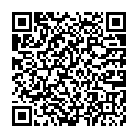

# Startup Weekend Aix-Marseille Maker Edition of 28-30th, October 2016

Content provided to attendees of https://www.eventbrite.com/e/startup-weekend-makers-aix-marseille-tickets-28261210040

Each of the following folders contains the kit schematics and the kit graphics (PNG with transparency):
* atmega328p-xmini
* Atmel_sam4e-xpro (Cortex-M4, 120MHz, USART, SPI, I²C, USB Full Speed, CAN, Ethernet (R)MII)
* Atmel_samd21-xpro (Cortex-M0+, 48MHz, USART, SPI, I²C, USB Full Speed)
* Atmel_samw25-xpro (module containing SAMD21 and WINC1500)
* Atmel_winc1500-xpro (Wifi extension)
* Atmel_io1-xpro (Versatile extension with LED, SD/TF Card reader, light sensor, temperature sensor, low-pass analog filter)
* Atmel_oled1-xpro (HMI extension with OLED SPI, LEDs and Push Buttons)
* Atmel_proto1-xpro (prototype extension)

Complementary information (screenshots) are available in 'images' folder.

Don't hesitate to share the QR codes to your peers for faster access!

Happy making!!!
